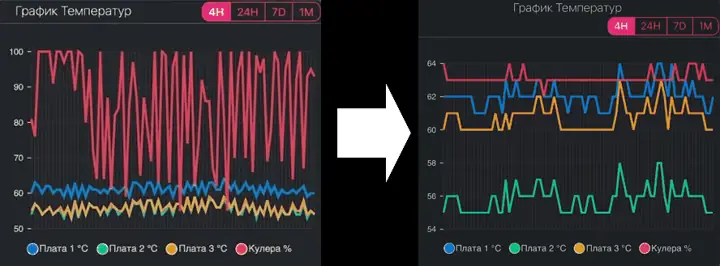

# Pitbit Soft Cooling



Automated cooling management for Pitbit miners.

> [!NOTE]
> This code has been tested on **Antminer S21**. The default temperature ranges are based on official [Bitmain factory recommendations](https://support.bitmain.com/hc/en-us/articles/360005088914-Miner-Normal-Operating-Temperature-Range).

## Overview
This script monitors the temperature of a miner on the Pitbit platform and dynamically adjusts the fan speed to maintain optimal temperatures (default 67-72°C).

## Development Approach
This project follows the **Software Design Document (SDD)** approach for formalizing requirements and architectural decisions. All design documentation is located in the [spec/](spec/) directory.

- [Software Design Document (SDD)](spec/SDD.md)
- [Architectural Decisions](spec/DECISIONS.md)

## Usage
The script requires `undetected_chromedriver` and a local Chrome installation.

```bash
python pitbit_auto.py [MINER_ID] [AUTH_KEY] [TEMP_MIN] [TEMP_MAX] [FAN_MIN] [FAN_MAX] [CHECK_INTERVAL] [DECREASE_CONFIRM_TIME]
```

Example:
```bash
python pitbit_auto.py 56948 YOUR_AUTH_KEY 67 72 30 100 10 60
```

For more details, see the [SDD](spec/SDD.md).
